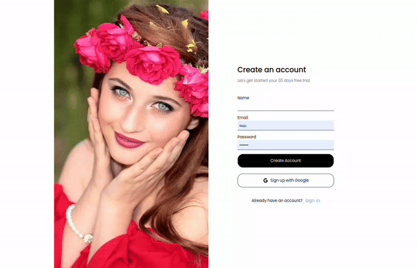

# 🌙 Tailwind Dashboard Dark Mode 🚀

  

## Overview

Welcome to this stylish dashboard created with Tailwind CSS! It's not just a dashboard; it's a dark-themed, customizable, and responsive wonderland for web applications.

## Features

- **Dark Mode Galore**: A sleek dark theme to save your eyes and add that touch of coolness.
- **Responsive Awesomeness**: It adapts like a chameleon to fit any screen size.
- **Customize All The Things**: Tailwind CSS makes it easy to tweak components to your heart's content.
- **Organized & Expandable**: The modular structure keeps everything tidy and ready for your creativity.
- **Utility Superpowers**: Tailwind CSS's utility classes speed up development like magic.

## Preview

Large Screen

Medium Screen

Small Screen

## Installation

1. Clone the repository: [Tailwind Dashboard Dark Mode](https://github.com/tiagoskaterock/tailwind-dashboard-darkmode)
2. Run `npm install` to conjure up the necessary dependencies.
3. Execute `npm run taildev` to wield Tailwind's dynamic classes.
4. Open it up on your local machine and voilà!
5. Oh, and don't forget to have fun! 🎉

## Need Help or Wanna Chat?

If you're lost in the dark or just want to share some bright ideas, feel free to reach out! I'm all ears for knowledge exchange and learning something new:

📧 Email: tiagolemespalhano@gmail.com  
🌐 Website: [cupcakessoft.com](https://cupcakesoft.com)
