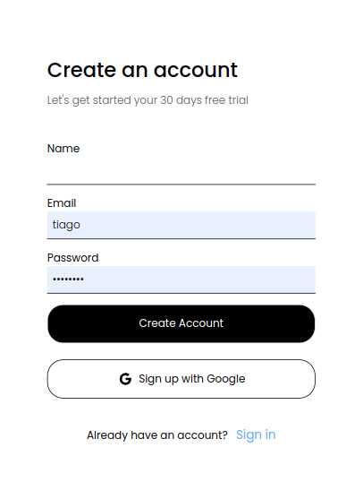

# 🌟 Formulario Adaptable 🚀

  

## Visión General

¡Bienvenido al proyecto Formulario Adaptable! Este proyecto tiene como objetivo ofrecer un formulario web adaptable, creado para ajustarse a diferentes dispositivos y tamaños de pantalla.

## Características

- **Enfoque en la Adaptabilidad**: Un formulario que se ajusta armoniosamente a varios dispositivos y tamaños de pantalla.
- **Personalizable y Versátil**: Ofrece opciones para personalizar los campos y el diseño según sus necesidades.
- **Sencillo y Eficiente**: Un diseño minimalista para garantizar una experiencia de usuario fluida.
- **Validación Integrada**: Incorpora validaciones para garantizar datos precisos y completos.
- **Fácil Integración**: Puede integrarse fácilmente en otros proyectos o sitios web.

## Vista Previa

<!--
Vista en Escritorio
-->
<!--

-->
<!--
-->

Vista en Dispositivo Móvil

## Instalación

1. Clona el repositorio en: https://github.com/tiagoskaterock/tailwind-formulario-adaptable)
2. Ejecuta `npm install` para instalar las dependencias necesarias.
2. Ejecuta `npm runtaildev` para actualizar Tailwind.
3. Realiza las personalizaciones deseadas en los archivos.
4. Integra el formulario adaptable en tu proyecto.
5. ¡Experimenta y adáptalo según tus necesidades!

## 쯅ecesitas Ayuda o Quieres Conversar?

Si necesitas ayuda o quieres intercambiar ideas, ¡no dudes en ponerte en contacto! Estoy aquí para ayudar y aprender cosas nuevas:

📧 Correo Electrónico: tiagolemespalhano@gmail.com  
🌐 Sitio Web: [cupcakesoft.com](https://cupcakesoft.com)
